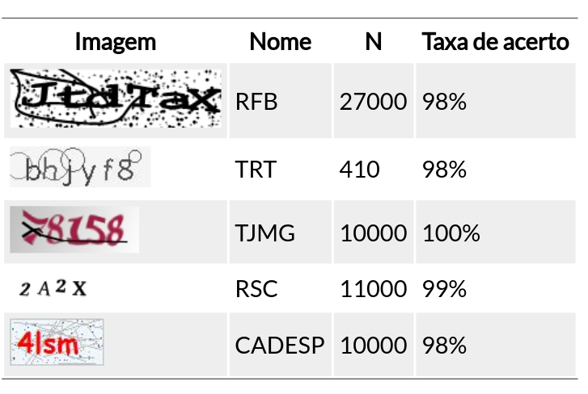

```{r setup, include = FALSE}
#options(xtable.comment = FALSE)
knitr::opts_chunk$set(echo = FALSE, 
                      message = FALSE, 
                      comment = FALSE, 
                      warning = FALSE, 
                      fig.height = 5, 
                      fig.width = 9)
```

```{r echo=FALSE}
library(tidyverse)
```


<!--chapter:end:index.Rmd-->

# Introdução

CAPTCHAs (*Completely Automated Public Turing test to tell Computers and Humans Apart*) são desafios criados com soluções fáceis de obter por humanos, mas difíceis de obter por robôs. Os CAPTCHAs nasceram entre 2000 e 2002 nos laboratórios da universidade de Carnegie Mellon [@von2002telling], como uma tecnologia utilizada para evitar ataques *spam*.

Ao longo dos anos, os CAPTCHAs tornaram-se comuns em diversas páginas da internet, podendo ser encontrados a partir de desafios de visão, audição, operações matemáticas, entre outros. Essa popularidade também trouxe iniciativas para resolver CAPTCHAs automaticamente, a partir de inputs humanos, heurísticas codificadas manualmente e até sistemas mais sofisticados de inteligência artificial. A disputa entre geradores e resolvedores gera debates profundos até os dias de hoje.

O problema de resolver CAPTCHAs não está na dificuldade, mas no contexto. Ao mudar o ambiente que circunda a tarefa, mudamos a base de dados necessária para lidar com o problema. Como o levantamento de novas bases de dados de treino é custosa, essa estratégia torna a resolução por métodos de força-bruta inexequíveis. Esse racional foi a base da criação da versão dois do **reCaptcha** da Google, amplamente utilizada nos dias de hoje.

Iniciamos este trabalho definindo o problema geral dos CAPTCHAs. Em seguida, mostramos a solução clássica e a solução força-bruta para o problema, apresentando os resultados obtidos até o momento. Encerramos o trabalho apresentando informalmente com os conceitos de eficiência e generalização, apontando os próximos passos que a pesquisa deve seguir.

<!--chapter:end:01-intro.Rmd-->

# Problema

A resolução de CAPTCHAs pode ser entendida como um problema de classificação de imagens. Especificamente, nosso interesse é criar uma função $g$ que recebe uma imagem $\mathbf X = \{x_{nmr} \in [0,1]\}_{N\times M \times R}$ e retorna um vetor de índices $\mathbf y$. Cada índice $y_j$ indica a presença de um caractere $c_j$, $j = 1, \dots, L$, onde $L$ é o número de caracteres contidos na imagem. Chamaremos $L$ de *comprimento* do Captcha, com $L \in  \mathbb{Z}_+$.

A obtenção de uma função $g$ capaz de mapear $\mathbf y$ a partir de uma nova imagem $\mathbf X$ depende de uma amostra de imagens $\mathbf X_1, \dots, \mathbf X_S$, corretamente classificadas 
através do vetor $\mathbf y_1, \dots, \mathbf y_S$. A tarefa é, portanto, obter uma estimativa $\hat g$ para a função $g$ que minimiza

$$
L(\hat g(\mathbf X), \mathbf y) = \mathbb I(g(\mathbf X) \neq \mathbf y)
$$

em que $\mathbb I(g(\mathbf X) \neq \mathbf y)$ indica se $g(\mathbf X)$ difere 
do que é observado em $\mathbf y$. Isto é, pretende-se encontrar uma função que minimize a taxa de classificação incorreta das imagens que descrevem os textos dos CAPTCHAs.

<!--chapter:end:02-problem.Rmd-->

# Solução {#results}

Um problema de resolver o CAPTCHA diretamente é que a variável resposta $\mathbf y$ tem um número exponencial de combinações. Na formulação da seção anterior, nossa resposta é uma palavra de $L$ caracteres, sendo que cada caractere $c_j$ pode ter $|\mathcal A|$ valores. Nessa construção, o total de combinações é $|\mathcal A|^L$.

Por isso, uma forma de resolver CAPTCHAs é separando o problema em duas tarefas: segmentar e classificar. A tarefa de segmentação consiste em receber uma imagem com várias letras e detectar pontos de corte, separando-a em várias imagens de uma letra. Já a classificação consiste em receber uma imagem com uma letra e identificar o caractere correspondente. Nesse caso, a resposta é reduzida para $|\mathcal A|$ categorias, que cresce linearmente e, portanto, tratável.

A literatura mostra através de estudos empíricos que a tarefa de segmentar é mais difícil do que a tarefa de classificar [@bursztein2014end]. Por esse motivo, os desenvolvedores de CAPTCHAs de imagens baseadas em texto têm explorado métodos de dificultar a segmentação. As principais formas são i) colar os caracteres e ii) adicionar linhas ligando os dígitos. Essas técnicas são combinadas com a adição de ruído e distorção de caracteres para compor a imagem final. 

Um problema dessa técnica é que ela é incapaz de trabalhar com CAPTCHAs de comprimento variável. Nesse caso, seria necessário construir um modelo não supervisionado para identificar a posição das letras, o que adiciona um grau a mais de complexidade na resolução do CAPTCHA.

Por isso, faz-se necessária uma abordagem que trabalha com problema completo, sem passar explicitamente pela fase de segmentação. Ao invés de cortar a imagem, vamos extrair detalhes da imagem completa automaticamente e utilizar essas características como variáveis preditoras num modelo de regressão. 

Essa abordagem utiliza redes neurais convolucionais, que explicamos a seguir.

Uma rede neural pode ser entendida como uma extensão de modelos lineares generalizados com a adição de uma arquitetura aos componentes do modelo. Para mostrar esse conceito, vamos partir da definição de um modelo regressão logística até construir uma rede neural com camadas ocultas.

O modelo linear generalizado é composto por três elementos: componente aleatório, componente sistemático e função de ligação. O componente aleatório é uma variável aleatória com distribuição pertencente à família exponencial, que dá origem à verossimilhança do modelo. O componente sistemático é uma combinação linear das variáveis preditoras com um vetor de parâmetros. A função de ligação é uma operação que leva a componente sistemática no valor esperado da componente aleatória. 

Uma forma de estender o modelo linear generalizado é considerando que o resultado da função de ligação aplicada ao componente sistemático é uma nova covariável. A vantagem dessa extensão é que adicionamos não linearidade ao modelo. Isso nos permite modelar relações mais complexas entre as preditoras e a resposta, o que pode resultar em melhores predições. 

A literatura de redes neurais costuma utilizar o nome função de ativação no lugar de ligação. O objetivo da função de ativação não é, necessariamente, modificar a faixa de variação do contradomínio, pois o resultado após a função pode ser uma nova covariável. Isso sugere a existência de certa liberdade na escolha de ativações. A única restrição é que a função de ativação deve ser não linear, pois, se fosse linear, a aplicação de várias camadas de funções resultaria numa única combinação linear. As ativações mais populares são aquelas que têm derivadas simples.

Já a verossimilhança ou o desvio são trocados por funções de perda. A natureza probabilística do modelo é considerada indiretamente através da função desvio. No entanto, ao invés de trabalhar com o desvio, os pesquisadores de redes neurais definem genericamente uma função de perda que mensura uma discrepância entre os valores observados e estimados.

A aplicação de camadas de não-linearidades pode ser representada através de um grafo direcionado acíclico. Essa representação é vantajosa por dois motivos. O primeiro é que a aplicação facilita a especificação e entendimento do modelo e seus parâmetros, que podem ficar com notação carregada na especificação por fórmulas matemáticas. A segunda é que é possível utilizar conhecimentos de teoria dos grafos para aumentar a eficiência dos algoritmos. Por exemplo, é possível aproveitar parte dos cálculos do *backpropagation* na obtenção das derivadas parciais da função de perda [@abadi2016tensorflow].

Agora partimos para a convolução. Considere uma imagem $P$ com 3x3 pixels. Considere agora o kernel $W$, também 3x3. A operação convolução resulta numa nova matriz 3x3, em que cada elemento é uma combinação linear de elementos de $P$ e $W$. O modelo de redes neurais convolucionais utilizado nesse trabalho é uma adaptação do clássico modelo LeNet-5.[@lecun2015lenet] Esse modelo aplica convolução 3 vezes consecutivas, adicionando o viés e a função ReLu em cada nível. Após cada convolução, também aplicamos uma operação chamada *max pooling*, que reduz a resolução da imagem, tomando o valor máximo da vizinhança de cada ponto. Após a aplicação das convoluções, as imagens são remodeladas no formato retangular padrão (uma linha por imagem) e aplicamos duas camadas de redes neurais comuns, como vimos anteriormente. Após a realização de todas as operações, os números resultantes não estão entre zero e um. Por isso, aplicamos a ativação *softmax*, que é a generalização da ativação logística, mas para uma resposta com vários resultados possíveis.

Em resumo, as operações que realizamos na rede neural convolucional são i) tomar o input inicial (imagem); ii) multiplicar (convoluir) por matrizes de pesos $W$; iii) adicionar um viés (ou intercepto) $b$; aplicar uma função de ativação; iv) Reduzir a resolução do resultado; v) voltar para (ii) várias vezes; vi) tomar os pesos finais e normalizar para obter as probabilidades.

# Resultados

Até o momento, aplicamos os modelos de redes neurais convolucionais para cinco CAPTCHAs distintos. Os modelos foram treinados a partir de bases de treino com aproximadamente dez mil exemplos para cada CAPTCHA. Os resultados da aplicação dos modelos estão na Tabela \@ref(tab:resultados). Essas taxas foram calculadas com base em 100 novos CAPTCHAs baixados da internet após o ajuste do modelo. Podemos observar que as taxas de acerto são todas muito próximas de 100%. No mínimo essas taxas estão muito próximas do que seres humanos conseguiriam acertar.

```{r resultados, out.width="0.6\\textwidth", fig.align='center'}
# tibble::tibble(
#   Imagem = c(knitr::include_graphics("imgs/rfb.png"),
#              "",
#              "",
#              "",
#              ""),
#   Nome = c("RFB", "TRT", "TJMG", "RSC", "CADESP"),
#   `Taxa de acerto` = c("98%", "98%", "100%", "99%", "98%"),
# ) %>%
#   knitr:::kable(caption = "Resultados da aplicação dos modelos.")

```

Os resultados positivos da aplicação dos modelos de redes neurais convolucionais pode motivar a pergunta: o problema está completamente resolvido? De fato, podemos dizer que CAPTCHAs de imagem baseados em textos são problemas resolvidos, desde que exista uma base de dados classificada. No entanto, esses modelos não funcionam para novos CAPTCHAs e também erram se fizermos pequenas alterações nas imagens.

## Pacote decryptr

Uma da nossas iniciativas principais neste trabalho é a criação do [pacote decryptr](https://github.com/decryptr/decryptr). A função `decrypt`, por exemplo, resolve o CAPTCHA a partir de uma imagem e um modelo.

```{r,  echo=TRUE, eval=FALSE}
decrypt('imgs/tjmg/captcha2f6e4f7825d6.jpeg', modelo)
#> "27755"
```

Também é possível chamar `decrypt` com o nome do modelo no lugar do próprio modelo carregado.

<!--chapter:end:03-solution.Rmd-->

# Discussão

A modelagem via redes neurais convolucionais apresenta resultados satisfatórios, mas tem dois problemas: eficiência e generalização. O problema de eficiência está relacionado com o fato de que a quantidade de imagens classificadas necessária para obter bom poder preditivo é alta. Já o problema de generalização implica que um modelo ajustado para um tipo CAPTCHA não funciona para outro, ainda que esses tipos sejam muito similares. 

```{r solucoes, echo=FALSE}
tibble::tribble(
  ~Eficiência, ~Generalização,
  "Feedback", "Ensemble",
  "Reciclagem", "Ruído",
  "Enriquecimento", ""
) %>% knitr::kable(caption = "Possíveis soluções para problemas de eficiência e generalização.")
```

A Tabela \@ref(tab:solucoes) mostra algumas possíveis abordagens para resolver esses problemas. A **reciclagem** consiste na aplicação de métodos de *data augmentation* usuais em processamento de imagens. A aplicação de **ruídos** na imagem segue o mesmo princípio da reciclagem, mas tem foco na generalização. A utilização de técnicas de **ensemble** visa compartilhar os parâmetros de um modelo de CAPTCHA em outro modelo. O **enriquecimento** surge do fato de que origem de novos parâmetros a serem adicionados a um modelo não precisam ser de CAPTCHAs ajustados anteriormente.  Um mecanismo de **feedback** é uma técnica usada de aumentar a eficiência do modelo ao adicionar informações ao modelo quando a predição falha. As informações são incluídas no modelo através de técnicas de aprendizado por reforço [@sutton1998introduction].

Existem duas formas de implementar mecanismos de feedback: automática e manual. A forma automática aproveita as vantagens da existência de um *oráculo* de baixo custo para aumentar o tamanho da base de dados automaticamente. O oráculo é uma função que recebe uma imagem e uma predição e informa se a predição está correta ou incorreta. O oráculo tem custo baixo de utilização pois existe em praticamente todos os sites da internet, pois geralmente o CAPTCHA está associado a um formulário de consulta (e.g. uma consulta processual), que verifica se o CAPTCHA foi corretamente resolvido. O problema do oráculo é que, quando algoritmo erra, não sabemos quais são as letras que foram preditas incorretamente. Por exemplo, num caso com $L=6$ letras e $|\mathcal A|=35$, a informação que o oráculo passa quando o algoritmo erra é que o valor correto do CAPTCHA não é uma das $36^6$ possibilidades. A forma manual utiliza a análise de humanos para inclusão de informações sobre cortes da imagem e erro das letras [@bursztein2014end]. Uma pergunta de pesquisa interessante nesse sentido seria: qual é a mínima intervenção suficiente para fazer o modelo aprender? Isso pode ser resolvido testando diversos inputs manuais e comparar o tempo de realização do feedback com o ganho em poder preditivo.

## Próximos passos

Nos próximos passos, vamos utilizar reciclagem, adição de ruídos, ensemble e enriquecimento para construir modelos mais eficientes e robustos. Pretendemos testar os impactos dessas técnicas na relação entre tamanho da base de treino e poder preditivo do modelo.

O grande desafio da pesquisa reside na investigação da forma automatizada de feedback. Caso seja possível evitar completamente o input humano para resolver os CAPTCHAs, o problema de aprendizado de CAPTCHAs baseados em texto estará completamente resolvido. Se não, vamos estudar quais são os limites da aplicação automatizada e buscar métodos que misturem eficientemente as duas formas de feedback.

<!--chapter:end:04-final.Rmd-->

`r if (knitr:::is_html_output()) '# References {-}'`

```{r include=FALSE}
knitr::write_bib(c(
  .packages(), 'bookdown', 'knitr', 'rmarkdown'
), 'bibliography/packages.bib')
```

# Referências {#references .unnumbered}

<!--chapter:end:ap01-decryptr.Rmd-->

