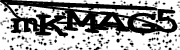
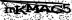
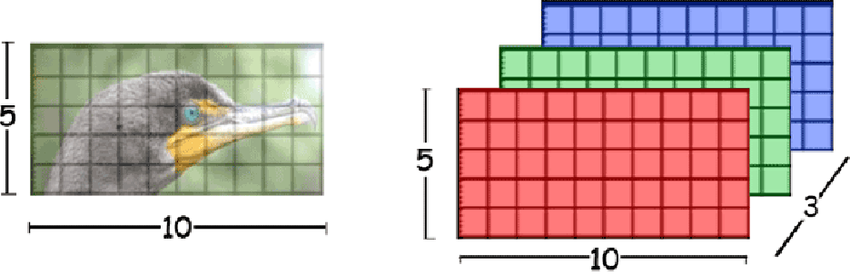
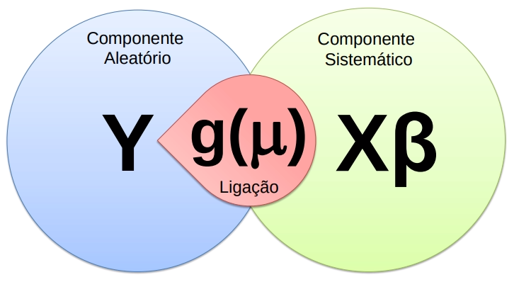
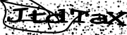
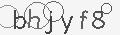
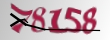
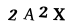
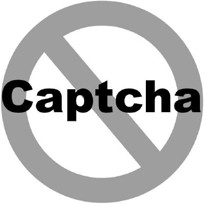

```{r setup, include=FALSE}
options(htmltools.dir.version = FALSE)
knitr::opts_chunk$set(echo = FALSE, message = FALSE, warning = FALSE,
                      fig.align = "center")
```

class: middle, inverse

# Contexto

---

# Motivação

```{r echo=FALSE, out.width="60%"}

```

--

- CAPTCHAs são desafios com resolução **fácil para humanos**, mas **difícil para robôs**. 

- Nasceram entre 2000-2002 em Carnegie Mellon para evitar _**spam**_ .

--

- Hoje são usados por muitos sites, inclusive para acesso de **dados públicos**.  

--

- Podemos argumentar que CAPTCHAs representam um **problema geral** da IA. 


---

# Desafio

- Com bases de treino suficientemente grandes, é **fácil** resolver CAPTCHAs.

--

- Gerar bases de treino para **novos** CAPTCHAs é custoso.

--

- **Oráculos** geram bases de treino incompletas com baixo custo.

--

## Questões norteadoras

1. Como usar o que aprendemos em casos **resolvidos** em **novos** casos?
1. Como **aproveitar** a informação do oráculo?

---

# Oráculo

```{r, out.width="90%"}

```

---

# Objetivo

Buscar formas eficientes e gerais de resolver CAPTCHAs de imagens com textos. 

### Objetivos específicos

1. Definir o problema do CAPTCHA e suas variações.
1. Mostrar solução de alta acurácia usando redes neurais convolucionais.
1. Fazer uma ponte entre regressão logística e redes neurais.
1. Implementar uma ferramenta para resolver CAPTCHAs.
1. Discutir e testar diversas abordagens para aprimorar
    - eficiência: como resolver com uma base de treino menor.
    - generalização: como usar um modelo para novos tipos de CAPTCHA.

---

# Objetivo

Buscar formas eficientes e gerais de resolver CAPTCHAs de imagens com textos. 

### Objetivos específicos

1. **Definir o problema do CAPTCHA e suas variações.**
1. **Mostrar solução de alta acurácia usando redes neurais convolucionais.**
1. **Fazer uma ponte entre regressão logística e redes neurais.**
1. **Implementar uma ferramenta para resolver CAPTCHAs.**
1. Discutir e testar diversas abordagens para aprimorar
    - eficiência: como resolver com uma base de treino menor.
    - generalização: como usar um modelo para novos tipos de CAPTCHA.

---

# Ganhos

--

## Presente

- Implementação do pacote `decryptr` na linguagem R para resolver CAPTCHAs.

- Ponte teórica entre modelo de regressão logística e redes neurais convolucionais utilizando notação comum para estatísticos.

- Resolução de novos CAPTCHAs.

--

## Futuro

- Implementação das metodologias mais recentes de forma reprodutível.

- Estudo e validação de novas abordagens para aumentar eficiência e generalização dos algoritmos.

- Investigação do uso de aprendizado por reforço e junção de modelos.

---
class: inverse, middle

# Teoria

---

# Definição

O que queremos?

- Criar uma função $g$ que 
    - recebe uma imagem $\mathbf X = \{x_{nmr} \in [0,1]\}_{N\times M \times R}$ e 
    - retorna um vetor de índices $\mathbf y = \{y_j \in \mathbb N\}_{L \times 1}$. 

- $c_j \in \mathcal A$, o alfabeto (e.g. letras e algarismos).

- $L$ é o número de caracteres contidos na imagem (*comprimento* do CAPTCHA).

- $y_j$ indica a presença de um caractere $c_j$, $j = 1, \dots, L$.


---

# Exemplo

```{r, out.width="40%"}

```

--

```{r eval=FALSE}
magick::image_read("captcha.png") %>% 
  magick::image_scale("40%") %>% 
  magick::image_write("captcha_small.png")
```

- $X$: , 50x180x1 = 9000 valores

- $L = 6$

- $c_1 =$ `m` (13ª letra $\rightarrow$ 13º elemento) $,\dots,c_6 =$ `5` (6º número $\rightarrow$ 32º elemento)

- $y_1 = 13,\dots,y_6 = 32$

- $g(X) = y = [13\;\; 11\;\; 13\;\; 1\;\; 7 \;\;32]^\top$

---

# Variáveis explicativas

As variáveis **explicativas** são retiradas da imagem, uma matriz $\mathbf X = \{x_{ijk}\}_{N\times M \times R}$, em que 

- $N$ é o número de linhas, 
- $M$ é o número de colunas e 
- $R$ é o número de *cores*, ou *canais*. 

O elemento $x_{nm\cdot}$ é denominado *pixel*.

```{r, fig.cap="Pratap Singh, Bhupendra"}

```

---

# Variável resposta

A **resposta** $\mathbf y \in \mathbb \{1, \dots, |\mathcal A|\}^L$ é um vetor de índices de tamanho fixo. 

- Cada elemento de $\mathbf y$ representa um elemento do alfabeto $\mathcal A$.

--

## Função objetivo

- Obter $g$ capaz de mapear $\mathbf y$ a partir de uma nova imagem $\mathbf X$

- Depende de uma amostra de imagens $\mathbf X_1, \dots, \mathbf X_S$, corretamente classificadas através do vetor $\mathbf y_1, \dots, \mathbf y_S$. 

- A tarefa é obter uma estimativa $\hat g$ para a função $g$ que minimiza

$$
R(g) = \mathbb E[\mathbb I(g(\mathbf X) \neq \mathbf Y)] = \mathbb P(g(\mathbf X) \neq \mathbf Y))
$$

para novas observações de $X$ e $Y$.

---

# De GLM a redes neurais

```{r echo=FALSE, out.width="70%", fig.align="center"}

```

---

# Exemplo: regressão logística

Componente aleatório

$$Y_i|x \sim \text{Bernoulli}(\mu_i)$$

Componente sistemático

$$\eta_i = \alpha + \sum_{j=1}^px_{ij}\beta_j$$

Função de ligação

$$g(\mu_i) = \log\left(\frac{\mu_i}{1-\mu_i}\right)$$

Ligando os componentes

$$\mu_i = g^{-1}(\eta_i) = \frac{1}{1+e^{-\eta_i}}$$

---

# Deviance

A log-verossimilhança é dada por

$$l(\boldsymbol \beta|\mathbf y) = \sum_{i=1}^n y_i\log(\mu_i) + (1-y_i)\log(1-\mu_i)$$

Uma forma útil de representar a log-verossimilhança é a partir da *função desvio*, dada por

$$D(\mathbf y|\boldsymbol \beta) = l(\mathbf y|\mathbf y) - l(\boldsymbol \beta|\mathbf y)$$

---

# Divergência de Kullback-Leibler

$$D_{KL}(p||q) = p\log\left(\frac p q\right) + (1-p)\log\left(\frac{1-p}{1-q}\right)$$

Deviance equivale à divergência de Kullback-Leibler

$$\begin{aligned}
D(\mathbf y|{ \boldsymbol \beta}) &= \sum_{i=1}^n y_i\log(y_i) + (1-y_i)\log(1-y_i) - \sum_{i=1}^n y_i\log(\mu_i) + (1-y_i)\log(1-\mu_i) \\
&=\sum_{i=1}^ny_i\log\left(\frac{y_i}{\mu_i}\right) + (1-y_i)\log\left(\frac{1-y_i}{1-\mu_i}\right) \\
&= \sum_{i=1}^n D_{KL}(y_i||\mu_i) \\
&= D_{KL}(\mathbf y||{\boldsymbol\mu}).
\end{aligned}$$

---

# Rede neural

- Componente aleatório: é equivante à divergência KL / Deviance.

--

- Componente sistemático: viés e matriz de pesos. 

Com uma unidade de ativação:

$$b^1 = \alpha^1\;\;\;\;\;\;\; W^1 = \left[\begin{array}{cc}\beta^1_{1}\\ \vdots \\ \beta^1_{p}\;\end{array}\right]^\top$$

--

Com duas unidades de ativação:

$$b^1 = \left[\begin{array}{cc}\alpha^1_1\\ \alpha^1_2\end{array}\right]\;\;\;\;\;\;\; W^1 = \left[\begin{array}{cc}\beta^1_{1,1}\;\beta^1_{1,2}\\ \vdots \\ \beta^1_{p,1}\;\beta^1_{p,2}\end{array}\right]^\top$$

--

- Função de ligação: função de ativação

$$Z^1 = g(W^1X^\top + b^1)$$

---

# Conclusões preliminares

- Um modelo de regressão logística é equivalente a uma rede neural com uma camada e uma unidade de ativação

--

- Podemos usar $Z^1$ como uma nova matriz $X$, iterativamente

--

- A forma usual de minimizar a deviance é diferente nos dois modelos:


- A regressão logística utiliza Newton-Raphson/Fisher Scoring (segunda derivada)

$$\beta_{new} = \beta - \mathcal I_\beta^{-1}\mathcal U_\beta,$$

onde 

- $\mathcal U_\beta$ é o vetor escore (gradiente) e

- $\mathcal I_\beta$ é a matriz de Informação (esperança da Hessiana).

--

- A rede neural utiliza descida de gradiente (primeira derivada)

$$\beta_{new}=\beta - \alpha\,\mathcal U_\beta$$

mais: http://bit.ly/athos-menor-dl

---

# Solução atual

- Utilizamos redes neurais convolucionais

--

- O modelo aplica uma operação diferente de $X\beta$ para produzir $\eta$. Essa operação é chamada convolução.

Por exemplo, considere a matriz de pesos 3x3

$$W = \left[\begin{array}{rrr}-1&-1&-1\\0&0&0\\1&1&1\end{array}\right]$$

--

E a janela 3x3 a partir do ponto $(12,16)$ da matriz $X$

$$X_{12,16} = \left[\begin{array}{rrr}
0.98 & 0.53 & 0.79 \\ 
0.97 & 0.99 & 1.00 \\ 
0.98 & 1.00 & 1.00 
\end{array}\right]$$

--

A convolução de $X$ por $W$ no ponto $(12,16)$ é dada por

$$\begin{aligned}
(X_{12,16} *w )_{12,16}
&= w_{1,1}x_{11,15} + w_{1,2}x_{11,16} + w_{1,3}x_{11,17} + \\
&+ w_{2,1}x_{12,15} + w_{2,2}x_{12,16} + w_{2,3}x_{12,17} + \\
&+ w_{3,1}x_{13,15} + w_{3,2}x_{13,16} + w_{3,3}x_{13,17}
\end{aligned}$$

--

- Essa operação aproveita melhor a relação de proximidade entre os pixels da imagem.

---

# Resultados


<table>
<tr> <th>Imagem             </th> <th>Nome</th> <th>N</th>     <th>Taxa de acerto</th></tr>
<tr> <td></td> <td>RFB</td>  <td>27000</td> <td>98%</td></tr>
<tr> <td></td> <td>TRT</td>  <td>410</td> <td>98%</td></tr>
<tr> <td></td> <td>TJMG</td>  <td>10000</td> <td>100%</td></tr>
<tr> <td></td> <td>RSC</td>  <td>11000</td> <td>99%</td></tr>
<tr> <td></td> <td>CADESP</td>  <td>10000</td> <td>98%</td></tr>
</table>

```{r eval=FALSE} 
library(magrittr)
tibble::tibble(
  Imagem = c("</img>", 
             "</img>", 
             "</img>", 
             "</img>",
             "</img>"), 
  Nome = c("RFB", "TRT", "TJMG", "RSC", "CADESP"), 
  N = c(27000, 410, 10000, 11000, 10000),
  `Taxa de acerto` = c("98%", "98%", "100%", "99%", "98%")
) %>% pander::pander()
  
  
  # knitr:::kable(caption = "Resultados da aplicação dos modelos.", format = "html")
```

---
class: inverse, middle

# Problemas e próximos passos

---

# Problemas e próximos passos

Possíveis soluções para problemas de eficiência e generalização:

```{r solucoes, echo=FALSE}
library(magrittr)
tibble::tribble(
  ~Eficiência, ~Generalização,
  "Reciclagem", "Ruído",
  "Enriquecimento", "Ensemble",
  "Feedback", ""
) %>% 
  knitr::kable(caption = "", 
               format = 'html')
```

--

- **reciclagem**: aplicar métodos de *data augmentation*.

--

- **ruído**: mesmo princípio da reciclagem, mas tem foco na generalização. 

--

- **enriquecimento**: Aproveitar ferramentas (OCR) e bases de caracteres. 

--

- **ensemble**: usar parâmetros ajustados de um modelo em outro. 

--

- **feedback**: Aproveitar o oráculo com alguma técnica de aprendizado por reforço.

---
class: inverse

# Agradecimentos

- Victor Fossaluza
- Rafael Izbicki
- Rafael Stern
- **Curso-R**: Athos, Caio, Daniel, Fernando, William


<a href="https://curso-r.com">

```{r, out.width="20%"}
knitr::include_graphics("logo-curso-2.png")
```

</a>

---

# Obrigado!

## Tese

- https://github.com/jtrecenti/doctorate

## `decryptr`

- https://github.com/decryptr/decryptr

- https://decryptr.netlify.com/


<a href="https://github.com/decryptr">

```{r, out.width="20%"}

```

</a>
