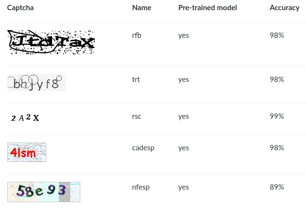

```{r setup, include=FALSE}
options(htmltools.dir.version = FALSE)
knitr::opts_chunk$set(echo = FALSE, message = FALSE, warning = FALSE,
                      fig.align = "center")
```

class: middle, inverse

# Contexto

---

# Motivação

```{r echo=FALSE, out.width="60%"}
knitr::include_graphics("captcha.png")
```

--

- CAPTCHAs são desafios com resolução **fácil para humanos**, mas **difícil para robôs**. 

- Nasceram entre 2000-2002 em Carnegie Mellon para evitar _**spam**_ .

--

- Hoje são usados por muitos sites, inclusive para acesso de **dados públicos**.  

--

- Podemos argumentar que CAPTCHAs representam um **problema geral** da IA. 


---

# Desafio

- Com bases de treino suficientemente grandes, é **fácil** resolver CAPTCHAs.

--

- Gerar bases de treino para **novos** CAPTCHAs é custoso.

--

- **Oráculos** geram bases de treino incompletas com baixo custo.

--

## Questões norteadoras

1. Como usar o que aprendemos em casos **resolvidos** em **novos** casos?
1. Como **aproveitar** a informação do oráculo?

---

# Oráculo

```{r, out.width="90%"}
knitr::include_graphics("oraculo.gif")
```

---

# Objetivo

Buscar formas eficientes e gerais de resolver CAPTCHAs de imagens com textos. 

### Objetivos específicos

1. Definir o problema do CAPTCHA e suas variações.
1. Mostrar solução de alta acurácia usando redes neurais convolucionais.
1. Fazer uma ponte entre regressão logística e redes neurais.
1. Implementar uma ferramenta para resolver CAPTCHAs.
1. Discutir e testar diversas abordagens para aprimorar
    - eficiência.
    - generalização.

---

# Objetivo

Buscar formas eficientes e gerais de resolver CAPTCHAs de imagens com textos. 

### Objetivos específicos

1. **Definir o problema do CAPTCHA e suas variações.**
1. **Mostrar solução de alta acurácia usando redes neurais convolucionais.**
1. **Fazer uma ponte entre regressão logística e redes neurais.**
1. **Implementar uma ferramenta para resolver CAPTCHAs.**
1. Discutir e testar diversas abordagens para aprimorar
    - eficiência.
    - generalização.

---

# Ganhos

--

## Presente

- Implementação do pacote `decryptr` na linguagem R para resolver CAPTCHAs.

- Ponte teórica entre modelo de regressão logística e redes neurais convolucionais utilizando notação comum para estatísticos.

- Resolução de novos CAPTCHAs.

--

## Futuro

- Implementação das metodologias mais recentes de forma reprodutível.

- Estudo e validação de novas abordagens para aumentar eficiência e generalização dos algoritmos.

- Investigação do uso de aprendizado por reforço e junção de modelos.

---
class: inverse, middle

# Teoria

---

# Definição

O que queremos?

- Criar uma função $g$ que 
    - recebe uma imagem $\mathbf X = \{x_{nmr} \in [0,1]\}_{N\times M \times R}$ e 
    - retorna um vetor de índices $\mathbf y = \{y_j \in \mathbb N\}_{L \times 1}$. 

- $y_j$ indica a presença de um caractere $c_j$, $j = 1, \dots, L$.

- $L$ é o número de caracteres contidos na imagem (*comprimento* do CAPTCHA).

- $c_j \in \mathcal A$, o alfabeto (e.g. letras e algarismos).

---

# Exemplo

```{r, out.width="40%"}
knitr::include_graphics("captcha.png")
```

--

```{r eval=FALSE}
magick::image_read("captcha.png") %>% 
  magick::image_scale("40%") %>% 
  magick::image_write("captcha_small.png")
```

- $X$: 

- $L = 6$

- $c_1 =$ `m` (13ª letra $\rightarrow$ 13º elemento) $,\dots,c_6 =$ `5` (6º número $\rightarrow$ 32º elemento)

- $y_1 = 13,\dots,y_6 = 32$

- $g(X) = y = [13\;\; 11\;\; 13\;\; 1\;\; 7 \;\;32]^\top$

---

# Variáveis explicativas

As variáveis **explicativas** são retiradas da imagem, uma matriz $\mathbf X = \{x_{ijk}\}_{N\times M \times R}$, em que 

- $N$ é o número de linhas, 
- $M$ é o número de colunas e 
- $R$ é o número de *cores*, ou *canais*. 

O elemento $x_{nm\cdot}$ é denominado *pixel*.

```{r, fig.cap="Pratap Singh, Bhupendra"}
knitr::include_graphics("matrix-rgb.png")
```

---

# Variável resposta

A **resposta** $\mathbf y \in \mathbb \{1, \dots, |\mathcal A|\}^L$ é um vetor de índices de tamanho fixo. 

- Cada elemento de $\mathbf y$ representa um elemento do alfabeto $\mathcal A$.

--

## Função objetivo

- Obter $g$ capaz de mapear $\mathbf y$ a partir de uma nova imagem $\mathbf X$

- Depende de uma amostra de imagens $\mathbf X_1, \dots, \mathbf X_S$, corretamente classificadas através do vetor $\mathbf y_1, \dots, \mathbf y_S$. 

- A tarefa é obter uma estimativa $\hat g$ para a função $g$ que minimiza

$$
R(g) = \mathbb E[\mathbb I(g(\mathbf X) \neq \mathbf Y)]
$$

para novas observações de $X$ e $Y$.

---

# De GLM a redes neurais

```{r echo=FALSE, out.width="70%", fig.align="center"}
knitr::include_graphics("glm.png")
```

Exemplo: regressão logística

- $Y|x \sim Bernoulli(p)$
- $g(\mu) = \log(\mu/(1-\mu))$

---

# Deviance

A log-verossimilhança é dada por

$$l(\boldsymbol \beta|\mathbf y) = \sum_{i=1}^n y_i\log(\mu_i) + (1-y_i)\log(1-\mu_i)$$

Uma forma útil de olhar para a verossimilhança é a partir da *função desvio*, dada por

$$D(\mathbf y|\boldsymbol \beta) = l(\mathbf y|\mathbf y) - l(\boldsymbol \beta|\mathbf y),$$

---

# Divergência de Kullback-Leibler

$$D_{KL}(p||q) = p\log\left(\frac p q\right) + (1-p)\log\left(\frac{1-p}{1-q}\right)$$

Deviance equivale à divergência de Kullback-Leibler

$$\begin{aligned}
D(\mathbf y|{ \boldsymbol \beta}) &= \sum_{i=1}^n y_i\log(y_i) + (1-y_i)\log(1-y_i) - \sum_{i=1}^n y_i\log(\mu_i) + (1-y_i)\log(1-\mu_i) \\
&=\sum_{i=1}^ny_i\log\left(\frac{y_i}{\mu_i}\right) + (1-y_i)\log\left(\frac{1-y_i}{1-\mu_i}\right) \\
&= \sum_{i=1}^n D_{KL}(y_i||\mu_i) \\
&= D_{KL}(\mathbf y||{\boldsymbol\mu}).
\end{aligned}$$


---

# Solução atual

---

# Resultados

```{r, out.width="90%"}

```

---

# Problemas

---

# Próximos passos

Possíveis soluções para problemas de eficiência e generalização:

```{r solucoes, echo=FALSE}
library(magrittr)
tibble::tribble(
  ~Eficiência, ~Generalização,
  "Feedback", "Ensemble",
  "Reciclagem", "Ruído",
  "Enriquecimento", ""
) %>% 
  knitr::kable(caption = "", 
               format = 'html')
```

--

- **reciclagem**: aplicar métodos de *data augmentation*.

--

- **ruídos**: mesmo princípio da reciclagem, mas tem foco na generalização. 

--

- **ensemble**: usar parâmetros ajustados de um modelo em outro. 

--

- **enriquecimento**: Aproveitar ferramentas (OCR) e bases de caracteres. 

--

- **feedback**: Aproveitar o oráculo com alguma técnica de aprendizado por reforço.

---
class: inverse

# Agradecimentos

- Victor Fossaluza
- Rafael Izbicki
- Rafael Stern
- **Curso-R**: Athos, Caio, Daniel, Fernando, William

```{r, out.width="20%"}
knitr::include_graphics("logo-curso-2.png")
```

---

# Obrigado!

## Tese

- https://github.com/jtrecenti/doctorate

## `decryptr`

- https://github.com/decryptr/decryptr

- https://decryptr.netlify.com/

```{r, out.width="20%"}
knitr::include_graphics("22989908.jpeg")
```
