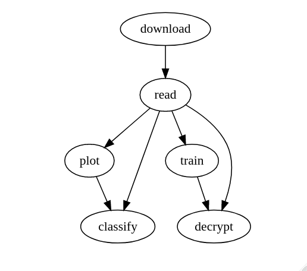

\clearpage

# (APPENDIX) Apêndice {-} 

# Pacote decryptr

Uma da nossas iniciativas principais nesta tese é a criação do [pacote decryptr](https://github.com/decryptr/decryptr). Abaixo mostramos como usar algumas das funções principais desse pacote.

Até o momento o `decryptr` possui as seguintes restrições:

1. Apenas imagens `jpg` ou `png`.
1. Uma imagem possui apenas números e letras.
1. A quantidade de caracteres de um CAPTCHA é fixa.
1. Dois CAPTCHAs de mesma origem têm sempre as mesmas dimensões.

O `decryptr` ainda não está no CRAN. Isso significa que para instalá-lo é necessário utilizar o `devtools`:

```{r eval=FALSE, echo=TRUE}
devtools::install_github('decryptr/decryptr')
```

## Funções do `decryptr`

As funções principais do `decryptr` são 

- `download_captcha()`: baixar imagens da web. 
- `read_captcha()`: adicionar metadados úteis a uma string com o caminho do CAPTCHA.
- `load_captcha()`: carregar a imagem na memória.
- `plot.captcha()`: método `S3` para desenhar o CAPTCHA na tela.
- `classify()`: método `S3` para classificar CAPTCHAs manualmente.
- `load_model()`: carregar um modelo já ajustado e armazenado no pacote `decryptrModels`
- `train_model()`: método `S3` para ajustar um modelo baseado em LeNet-5 para os CAPTCHAs.
- `decrypt()`: método `S3` para classificar um CAPTCHA a partir de um modelo ajustado e um caminho de imagem.

### Fluxo de utilização

O modo de uso planejado do `decryptr` está descrito na Figura \@ref(fig:fluxo).

```{r fluxo, fig.cap='Fluxo de utilização do pacote `decryptr`.', echo=FALSE, out.width="60%", fig.align="center"}
# DiagrammeR::grViz('
# digraph rmarkdown {
# graph [layout = dot]
# 
# edge [color = black]
# download->read
# read->plot
# read->classify
# plot->classify
# read->train
# train->decrypt
# read->decrypt
# }', height = 400, width = 500)


```

### Download

A função `download_captcha()` tem cinco parâmetros:

- `url=` o link do CAPTCHA que queremos baixar.
- `n=` a quantidade de CAPTCHAs a serem baixados.
- `path=` a pasta que queremos salvar a imagem.
- `secure=` se `TRUE`, fará o download com a opção `ssl_verifypeer = FALSE` ([veja esse post](http://curso-r.com/blog/2017/03/31/2017-03-31-ssl/))
- `ext=` extensão do arquivo (`jpg`/`jpeg` ou `png`).

Para facilitar a utilização do `decryptr`, adicionamos algumas atalhos do tipo `download_captcha("nome")`, que já contêm os padrões para download de alguns sites específicos:

- `download_captcha("rfb")`: [Consulta de CNPJ da Receita federal](http://www.receita.fazenda.gov.br/pessoajuridica/cnpj/cnpjreva/cnpjreva_solicitacao2.asp).
- `download_captcha("saj")`: [Sistema SAJ (vários Tribunais Estaduais)](https://esaj.tjsp.jus.br/cjsg/imagemCaptcha.do).
- `download_captcha("tjmg")`: [Tribunal de Justiça de Minas Gerais](http://www4.tjmg.jus.br/juridico/sf/captcha.svl).
- `download_captcha("tjrj")`: [Tribunal de Justiça do Rio de Janeiro](http://www4.tjrj.jus.br/consultaProcessoWebV2/captcha).
- `download_captcha("tjrs")`: [Tribunal de Justiça do Rio Grande do Sul](http://www.tjrs.jus.br/site_php/consulta/human_check/humancheck_showcode.php).
- `download_captcha("trt")`: [Tribunais Regionais do Trabalho](https://pje.trt3.jus.br/consultaprocessual/seam/resource/captcha).

Exemplo:

```{r eval=FALSE, echo=TRUE}
library(decryptr)
# salva arquivo em ./assets/img/tjmg/captcha<id>.jpeg
arq <- download_captcha("tjmg", n = 1, path = 'assets/img/tjmg') 
```

### Visualização

Para plotar um CAPTCHA basta ler o arquivo com `read_captcha()` e depois usar a função `plot()`. Exemplo:

```{r fig.height=1.5, fig.width=4, fig.cap='CAPTCHA do TJMG.', echo=TRUE, eval=FALSE}
library(decryptr)
'assets/img/tjmg/captcha2f6e4f7825d6.jpeg' %>% 
  read_captcha() %>% 
  dplyr::first() %>% 
  plot()
```

### Classificação

A classificação manual de CAPTCHAs é importante para possibilitar o treino de modelos preditivos. Para classificar um CAPTCHA você pode utilizar a função `classify()`, assim:

```{r fig.height=1.5, fig.width=4, fig.cap='Classificando CAPTCHA do TJMG.', echo=TRUE, eval=FALSE}
'assets/img/tjmg/captcha2f6e4f7825d6.jpeg' %>% 
  classify()
```

Essa função executa duas tarefas:

- Plota o CAPTCHA na tela.
- Abre um console para o usuário digitar o valor do CAPTCHA manualmente.

Ao escrever o valor o CAPTCHA e pressionar `<enter>`, a função `classify()` adicionará a classificação no nome do arquivo da imagem. A função `classify()` gera uma cópia para que seja impossível de perder a imagem original.

Algumas opções do `classify()`:

- `answers=` adicionar uma resposta ao invés de esperar abrir o console. Essa opção é útil quando as classficações são feitas automaticamente (e.g., por um quebrador de CAPTCHAs que usa o áudio no lugar da imagem.)
- `path=` colocar uma pasta para classificar os CAPTCHAs. Por padrão é a pasta onde os originais estão.

### Carregar modelo

A função `load_model()` é responsável por carregar modelos pré treinados

```{r, echo=TRUE, eval=FALSE}
modelo <- decryptr::load_model("tjmg")
modelo$model
```

```{r, eval=FALSE}
# Layer (type)                   Output Shape                Param #    
# ======================================================================
# conv2d_4 (Conv2D)              (None, 40, 110, 4)          104        
# ______________________________________________________________________
# max_pooling2d_4 (MaxPooling2D) (None, 20, 55, 4)           0          
# ______________________________________________________________________
# conv2d_5 (Conv2D)              (None, 20, 55, 16)          1616       
# ______________________________________________________________________
# max_pooling2d_5 (MaxPooling2D) (None, 10, 27, 16)          0          
# ______________________________________________________________________
# conv2d_6 (Conv2D)              (None, 10, 27, 32)          12832      
# ______________________________________________________________________
# max_pooling2d_6 (MaxPooling2D) (None, 5, 13, 32)           0          
# ______________________________________________________________________
# flatten_2 (Flatten)            (None, 2080)                0          
# ______________________________________________________________________
# dense_3 (Dense)                (None, 16)                  33296      
# ______________________________________________________________________
# dropout_2 (Dropout)            (None, 16)                  0          
# ______________________________________________________________________
# dense_4 (Dense)                (None, 50)                  850        
# ______________________________________________________________________
# reshape_2 (Reshape)            (None, 5, 10)               0          
# ______________________________________________________________________
# activation_2 (Activation)      (None, 5, 10)               0          
# ======================================================================
# Total params: 48,698
# Trainable params: 48,698
# Non-trainable params: 0
# ______________________________________________________________________
```

### Resolver captcha

A função `decrypt` resolve o CAPTCHA a partir de uma imagem e um modelo.

```{r,  echo=TRUE, eval=FALSE}
decrypt('assets/img/tjmg/captcha2f6e4f7825d6.jpeg', modelo)
#> "27755"
```

Também é possível chamar `decrypt` com o nome do modelo no lugar do próprio modelo carregado.
